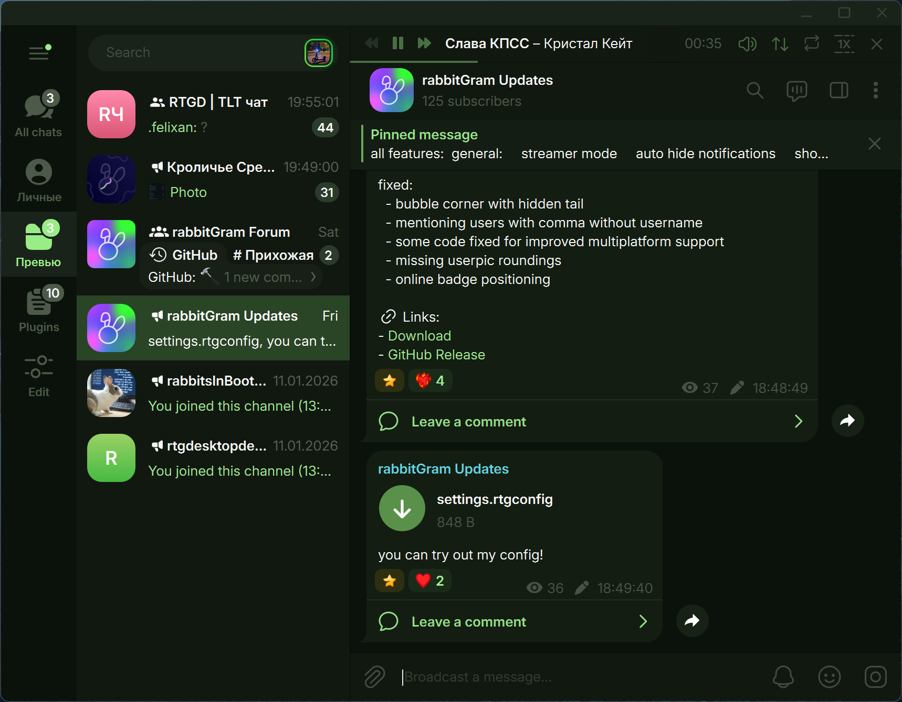

# rabbitGram Desktop

# ⚠️ Now closed-source. Updates are available on [GitHub][updates_gh] and [Telegram][updates_tg].

### Telegram Desktop based messenger with special features

This is the complete source code and the build instructions for the app based on the official [Telegram][telegram] messenger desktop client.

The source code is published under GPLv3 with OpenSSL exception, the license is available [here][license].

## Features

### General
* Streamer mode
* Auto-hiding notifications
* Always show userpic in chat top bar
* Disable connecting/proxy popup on bottom left
### Appearance
* Mutliple app icons (thx Ayugram)
* Userpic corners
* Side menu editor
### Chats
* Sticker size
* Recent stickers limit
* Show time with seconds
* Chat actions time
* Comma after mention
### Miscellanous
* Go to first message
* Spoof WebView as Android (type "rtgspoof" in settings, thx AyuGram)
* Solar Icons (thx 480 Design)
* Force react in channels on double-click
* Improved UI

## Supported systems

The latest version is available for

* Windows 7 and above (x64, installer and portable)

You can build rabbitGram Desktop yourself using [build instructions][build_instructions]

## Build instructions

* [Windows (32-bit and 64-bit)][win]
* [macOS][mac]
* [GNU/Linux using Docker][linux]

## Special thanks to

* [exteraGram (for some ideas)][exteragram]
* AyuGram
* [Kotatogram][kotatogram]
* [Materialgram][materialgram]
* [64Gram][64gram]

[//]: # (LINKS)
[telegram]: https://telegram.org
[license]: LICENSE
[win]: docs/building-win.md
[mac]: docs/building-mac.md
[linux]: docs/building-linux.md
[macos]: docs/building-mac.md
[build_instructions]: https://github.com/rabbitGramDesktop/rabbitGramDesktop#build-instructions
[exteragram]: https://t.me/exteraGram
[kotatogram]: https://github.com/kotatogram/kotatogram-desktop
[materialgram]: https://github.com/kukuruzka165/materialgram
[64gram]: https://github.com/TDesktop-x64/tdesktop
[updates_tg]: https://t.me/rabbitGramUpdates
[updates_gh]: https://github.com/rabbitgramdesktop/rtgdupdates/releases